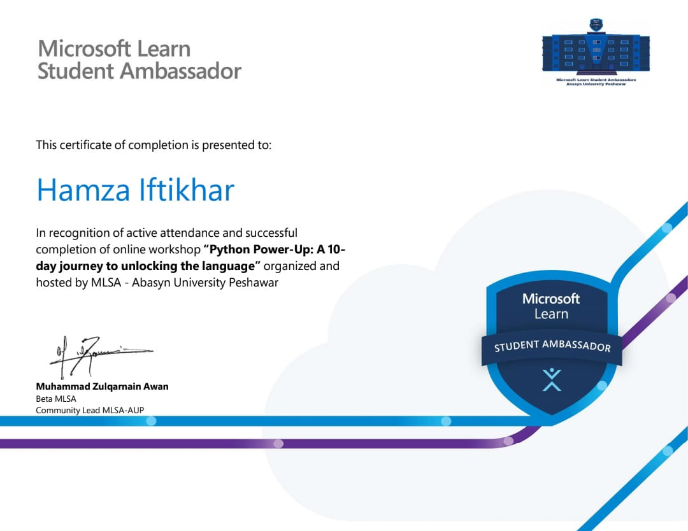

# MLSA-AUP-PYTHON-POWER-UP
### A 10-Days journey to unlocking Python Language features.

- [Day-01](https://github.com/hamzaiftkhar/MLSA-AUP-PYTHON-POWER-UP/tree/main/Day-01)   Overview, Input/Output, Variables, DataTypes, String Operations, Conditional Statements in Python Programming Language.

- [Day-02](https://github.com/hamzaiftkhar/MLSA-AUP-PYTHON-POWER-UP/tree/main/Day-02) List, Tuple, Dictionary, Set, and their operations in Python Programming Language.

- [Day-03](https://github.com/hamzaiftkhar/MLSA-AUP-PYTHON-POWER-UP/tree/main/Day-03)  Loops in Python Programming Language.

- [Day-04](https://github.com/hamzaiftkhar/MLSA-AUP-PYTHON-POWER-UP/tree/main/Day-04) Functions in Python Programming Language.

- [Day-05](https://github.com/hamzaiftkhar/MLSA-AUP-PYTHON-POWER-UP/tree/main/Day-05) OOP in Python Programming Language.

- [Day-06](https://github.com/hamzaiftkhar/MLSA-AUP-PYTHON-POWER-UP/tree/main/Day-06) Inheritance and its types in Python Programming Language.

- [Day-07](https://github.com/hamzaiftkhar/MLSA-AUP-PYTHON-POWER-UP/tree/main/Day-07) Polymorphism and its types in Python Programming Language.

- [Day-08,9,10](https://github.com/hamzaiftkhar/MLSA-AUP-PYTHON-POWER-UP/tree/main/Day-8%2C9%2C10) Project : Library Management System

## Certificate:

